# Instalasi Git
Git tersedia untuk berbagai sistem operasi. Git bisa menggunakan antarmuka _GUI_ maupun _CLI_. 

## Instalasi Git pada Windows
Sebelum menginstal Git harus mempunyai editor teks disini saya menggunakan **Visual Studio Code**. Berikut langkah-langkah instalasi Git:

1. Setelah download Git, double click pada file yang telah didownload.
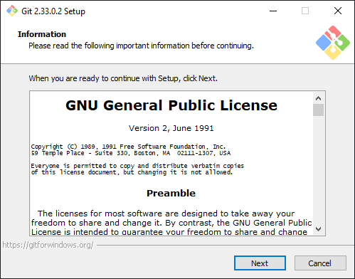
2. Setelah itu, pilih lokasi instalasi.
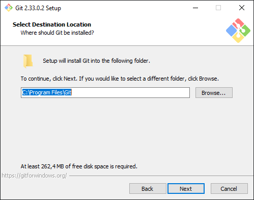
3. Pilih komponen. Tidak perlu diubah.
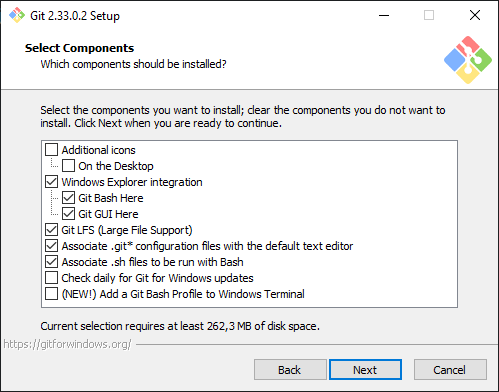
4. Mengisi shortcut untuk menu start.
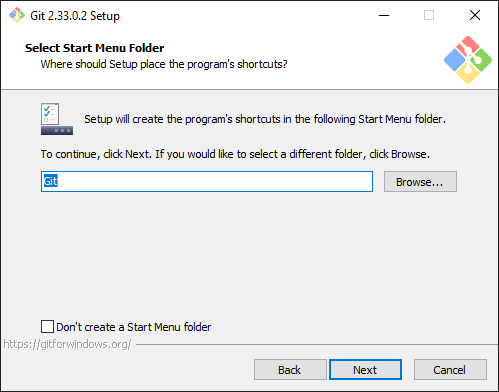
5. Pilih editor teks akan digunakan. Menggunakan Visual Studio Code.
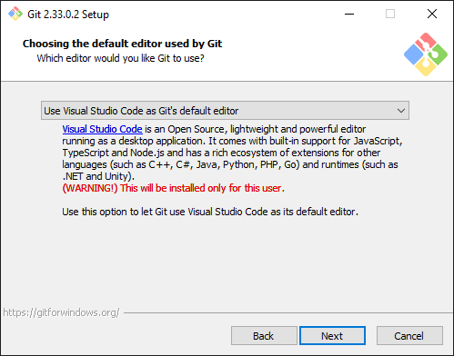
6. Git menyediakan dua pilihan untuk mengakses git. Bash adalah shell di Linux sedangkan Command Prompt di Windows.
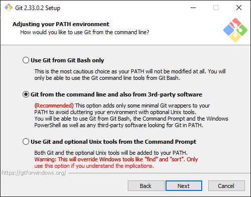
7. Pilih OpenSSL untuk HTTPS digunakan untuk mengakses repo GitHub
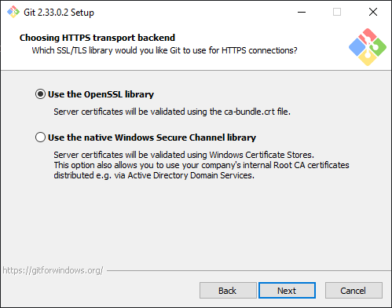
8. Pilih pilihan pertama untuk konversi akhir baris.

9. Pilih PuTTY untuk terminal yang digunakan untuk mengakses Git Bash.
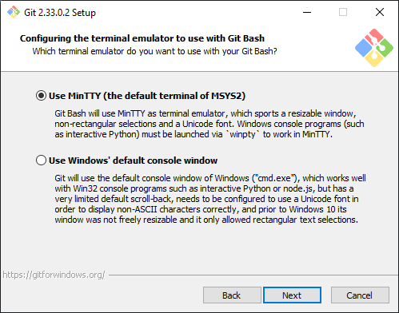
10. Untuk opsi ekstra, pilih dan aktifkan pilihan 1.
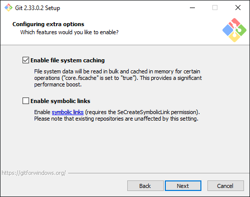
11. Proses instalasi akan dilakukan, jika sudah selesai klik **Finish**.
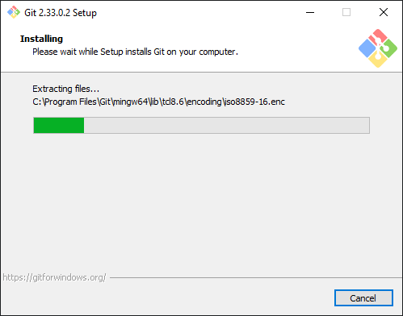
12. Search "Git", pilih "Git Bash".
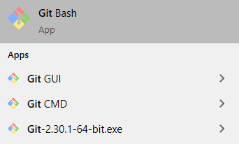
13. Tampilan jika menggunakan "Git Bash".
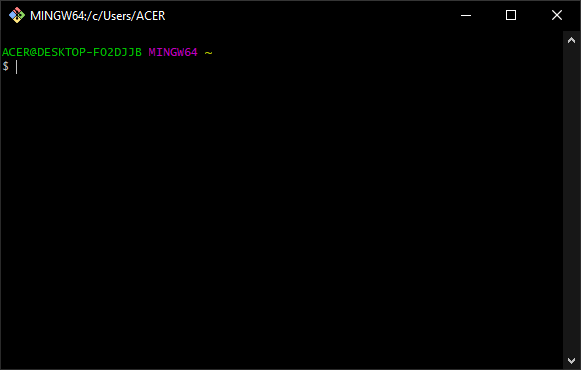
14. Ketikkan "git --version" pada command prompt untuk melihat apakah sudah terinstal atau belum
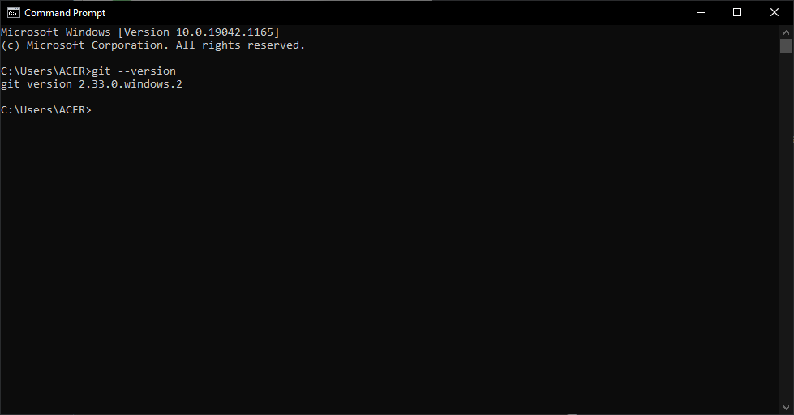

## Konfigurasi Git
User harus memberitahu Git username serta email yang akan digunakan setiap kali terjadi perubahan pada repo Git. Konfigurasi ini akan disimpan **C:\users\NamaUser** dengan nama file **.gitconfig**. Menggunakan perintah berikut:
```
[user]
    name = nama user
    email = email user
```

## Membuat Repo
Berikut langkah-langkah membuat repo:

1. Klik tanda + pada bagian atas, pilih **New repository**.
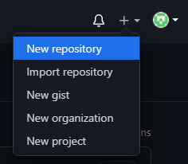
2. Isikan nama, keterangan, serta lisensi. Klik **Create Repository**.
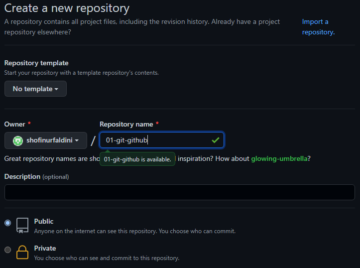

## Clone Repo
Proses clone adalah proses untuk menduplikasi repo di GitHub ke komputer lokal. Untuk melakukan proses clone menggunakan perintah berikut:

1. Copy url repo yang akan di clone. 
2. Buka Visual Studio Code klik **View** kemudian **Command Pallete** ketikkan clone lalu masukkan urlnya.
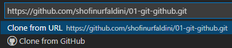
3. Membuat folder untuk menyimpan clone tersebut. Jika sudah tunggu sampai proses clone selesai.
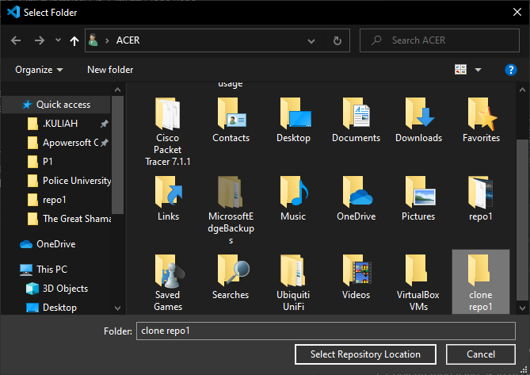 

## Upload File ke GitHub
Berikut langkah-langkah mengupload file ke GitHub:

1. Klik kanan pada file yang akan diupload, pilih Git Bash here.
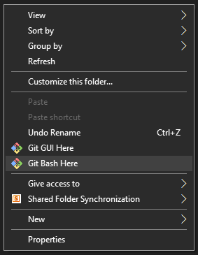
2. Melakukan inisialisasi terlebih dahulu dengan perintah:
    ```
    git init
    ```
3. Menambahkan semua file dengan perintah:
    ```
    git add .
    ``` 
4. Melihat status dengan perintah:
    ```
    git status
    ```
5. Commit pesan dengan perintah:
    ```
    git commit -m "menuliskan pesan"
    ```
6. Git remote dengan perintah:
    ```
    git remote add origin https://github.com/shofinurfaldini/01-git-github.git
    ```
7. Git push -u origin master lalu ketikkan username dan password dengan perintah:
    ```
    Git push -u origin master
    ```
8. Yang terakhir refresh halaman GitHub.